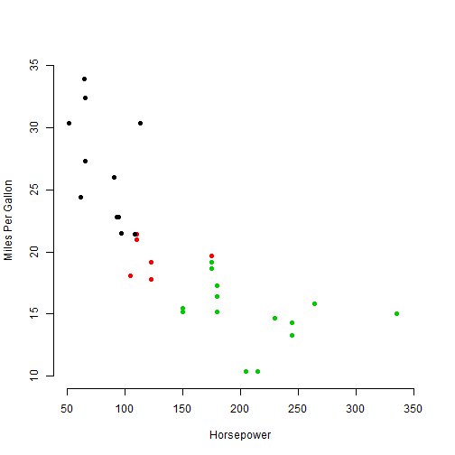

CourseraDDP-presentation
========================================================
author: Cheuk T Ho
date: 08/10/2017
autosize: true

Predict MPG from Horsepower
========================================================

Ever wonder if your car use more petrol then it should? Wonder how does it compare to other cars. Now with this app you dont have to be a data sciencetist to be able to predict the MPG (miles per gallon) of your car.

You only need to know:

- the horse power of your car
- (optional) the number of cylinder of your car

The Data Set
========================================================

To predict, the "mtcars" data set is used:


```
                   mpg cyl disp  hp drat    wt  qsec vs am gear carb
Mazda RX4         21.0   6  160 110 3.90 2.620 16.46  0  1    4    4
Mazda RX4 Wag     21.0   6  160 110 3.90 2.875 17.02  0  1    4    4
Datsun 710        22.8   4  108  93 3.85 2.320 18.61  1  1    4    1
Hornet 4 Drive    21.4   6  258 110 3.08 3.215 19.44  1  0    3    1
Hornet Sportabout 18.7   8  360 175 3.15 3.440 17.02  0  0    3    2
Valiant           18.1   6  225 105 2.76 3.460 20.22  1  0    3    1
```

View data in a plot: MPG vs Horsepower
========================================================



The App
========================================================
There are relations among the mpg, horsepower and number of cylinders so we can predict one from anothers. The models used in the app is linear regression. 

However, you dont have to know how to do linear regression, simply imput the features of your car in the app:

https://cheuktingho.shinyapps.io/mymtcars/
